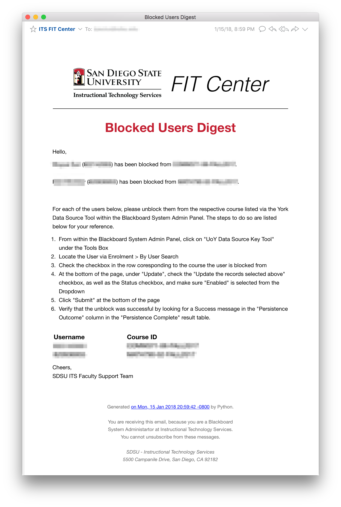

Blocked User Automation Script
==============================

Occasionally, a user in our Blackboard System will be blocked from a course for
one reason or another, although this is often caused by conflicts in our
enrollment system (Students who Add/Drop a class). We collect the data via a
Type Form, specifically their Name, Username, and the Course that they are
blocked from. This form can be customized to your specific needs.

Each Blackboard configuration will have a slightly different method of unblocking
users. The Email, and its template, can be customized to your department and system
administrators needs.

# Configuration
The configuration is broken down into 2 sets (Typeform setup and Script Setup)

## Typeform
Setup a Typeform, that contains text areas that have all the fields that you
need for your specific SQL and Email needs. Next, make note of your Typeform API
key, which can be found in your Account Profile, and your form's Unique ID -
which can be found in the URL of your form.

More information on the Typeform Data API can be found on their website: https://www.typeform.com/help/data-api/

Go to the API URL for your form, and make note of which filed IDs correlate to the specific fields you wish to use in your mailings.
The URL would look something like this: `https://api.typeform.com/v1/form/[typeform_UID]?key=[your_API_key]`

On the first run of the script, a folder will be created in your Home Folder
called `its` you can create this folder before, and into it, you will need to
load the Form Config file, `form_config.json`, it will have the following
format.

```
{
  "fname": "textfield_29648294",
  "lname": "textfield_29648309",
  "username": "textfield_29648412",
  "course": "textfield_29648347",
  "context": "textarea_29648508"
}
```

## Email (Sender & Receiver)
An SMTP Server and credentials are required to send emails from the Aggregator.
Services like [Sendgrid](https://sendgrid.com/) are recommended over services
like Gmail, because they are less likely to disable your account for sending
a large number of emails.

When you first run the script, you will be prompted to provide the Sender and
recipient information.

For the Recipients, you can provide a list of email addresses, separated by
commas, similar to how one would enter them in the TO line of an email.

If you ever need top update the configuration, simply run the following command
similar to how you ran the initial merge command.
```
python blocked_users.py --update
```

# Sample Email

